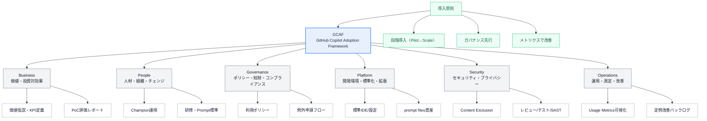

# 6視点の1枚絵（CAFライク）

```mermaid
flowchart TB
    C["GCAF<br/>GitHub Copilot Adoption Framework"]

    B["Business<br/>価値・投資対効果"]
    P["People<br/>人材・組織・チェンジ"]
    G["Governance<br/>ポリシー・知財・コンプライアンス"]
    PL["Platform<br/>開発環境・標準化・拡張"]
    S["Security<br/>セキュリティ・プライバシー"]
    O["Operations<br/>運用・測定・改善"]

    C --> B
    C --> P
    C --> G
    C --> PL
    C --> S
    C --> O

    B --> B1["価値仮説・KPI定義"]
    B --> B2["PoC評価レポート"]

    P --> P1["Champion運用"]
    P --> P2["研修・Prompt標準"]

    G --> G1["利用ポリシー"]
    G --> G2["例外申請フロー"]

    PL --> PL1["標準IDE/設定"]
    PL --> PL2["prompt files資産"]

    S --> S1["Content Exclusion"]
    S --> S2["レビュー/テスト/SAST"]

    O --> O1["Usage Metrics可視化"]
    O --> O2["定例改善バックログ"]

    R["導入原則"] --> R1["段階導入（Pilot→Scale）"]
    R --> R2["ガバナンス先行"]
    R --> R3["メトリクスで改善"]

    R --> C

    classDef core fill:#e8f0fe,stroke:#3b82f6,color:#1f2937,stroke-width:2px;
    classDef pillar fill:#f3f4f6,stroke:#6b7280,color:#111827,stroke-width:1px;
    classDef artifact fill:#ffffff,stroke:#9ca3af,color:#111827,stroke-width:1px;
    classDef principle fill:#ecfdf5,stroke:#10b981,color:#065f46,stroke-width:1px;

    class C core;
    class B,P,G,PL,S,O pillar;
    class B1,B2,P1,P2,G1,G2,PL1,PL2,S1,S2,O1,O2 artifact;
    class R,R1,R2,R3 principle;
```
